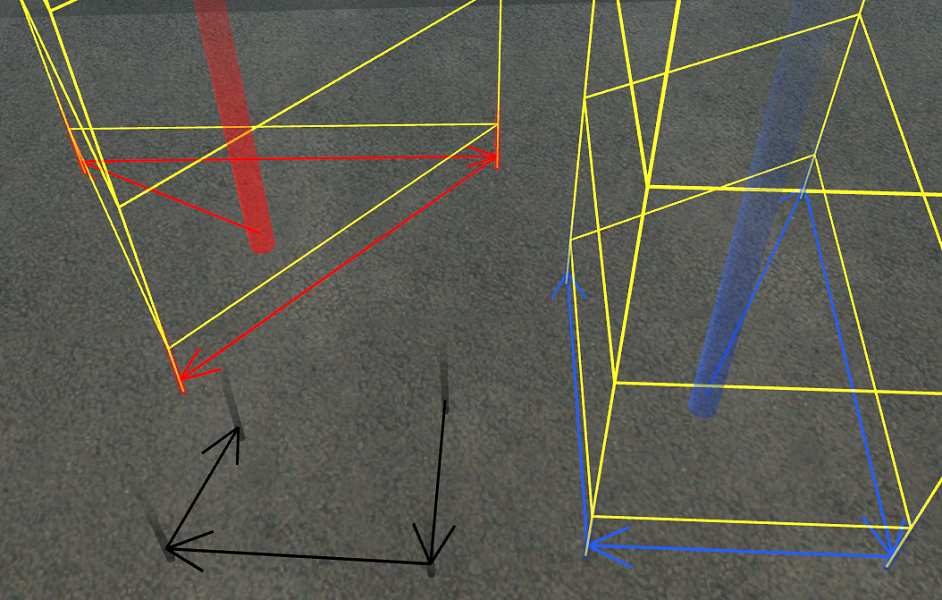

# Getting started
To use this editor plugin, simply add this resource to your resources in
`MultiTheftAuto/server/mods/deathmatch/resources`. Launch editor (must be restarted if
you added this resource after starting editor). In editor, go to definitions, add
`polygons` and start creating!

# Usage in editor
All features listed are client-based, which means that collaborative polygon creation
is very convenient and easy to do. Editor built-in undo/redo functionality works well
with this plugin. However, due to the inner workings of undo/redo, if you undo creating
or modifying an existing `polygon-vertex` or `polygon-center` and then save the map, it
will have non-existing vertices as "first" or "next" attributes. When creating colshapes
later in the server/gamemode, it will produce warnings. To fix this, simply load the map
in Editor and save it again. All non-existing "pointers" to first or next vertices will
be unset. Due to the nature of editor's undo/redo functionality, one player can undo
other player's changes and thus cause the inconvenience described above.



## Features:
- Both elements are represented by markers and connections (edges) are represented by
arrows

- Color of the markers and arrows signals the state of each polygon:
    - red - currently selected polygon and its vertices
    - blue - other polygons and their vertices
    - black - vertices not belonging to a `polygon-center` element - resulting shape
    will not create a colshape in resulting map file

- Created colshapes may be seen by using command `/showpoly`. If a colshape is created
and can be seen in editor, it will be correctly recreated from the resulting map file

- Holding `LCTRL` while placing vertices will automatically create new vertices attached
after previously placed vertex, allowing for quick and easy placing of multiple vertices

- When creating a new vertex while having an existing vertex selected, the new vertex
will be inserted between the selected vertex and its next vertex (if exists)

- When creating a new vertex while having a polygon selected (but not a vertex), the new
vertex will be attached after the last vertex in that polygon

- Last vertex in a polygon may have it's "next" set to the polygon's first vertex,
forming a loop, but it is not necessary - last edge is always present, even if not drawn
with an arrow (you can use `/showpoly` to confirm this)

# Usage in server/gamemode
To create actual colshapes based on abstract `polygons` elements, you can either:

- copy `create-polygons.lua` from the resource into your map resource (remember
to update meta.xml)

- use `polygons` resource on your server, which creates colshapes using resources (maps)
with `polygon-center` and `polygon-vertex` elements in following ways:
    - for every resource started before `polygons`, and
    - for every resource started after `polygons`, as well as destroying colshapes
    belonging to that resource once it is stopped

    **NOTE:** as the resource root element of those colshapes will be `polygons`, they
    will be destroyed once this resource is stopped

To use those colshapes in your scripts, use `polygon-center` element's ID and the
colshape it defines, using `getElementData` with key `"polygon-colshape"`. For example:
```lua
local polygonID = "polygon (1)" -- this is the elementID from a map file
local polygon = getElementByID(polygonID)
local colshape = getElementData(polygon, "polygon-colshape")
```

# EDF elements explained
Each abstract polygon, which defines the shape of the actual colshape polygon element, consists of one `polygon-center` element and at least three `polygon-vertex` elements.

- `polygon-center` defines the center position of the resulting colshape. It's property
named "first" points to the first `polygon-vertex` element defining the polygon's shape
- `polygon-vertex` defines each vertex (corner) of the resulting colshape. It's property
named "next" points to the next `polygon-vertex` element in that polygon's vertices list.

Together they define an abstract 'polygon', which is used to create the actual colshape.

# Exporting polygons as Lua code
## *Coming Soon!*
Export will look like this:
```lua
createColPolygon(x, y, 1, 1, 3, 5, 9, 17, ...)
```

# Sources
Line drawing in editor based on MTA Race gamemode EDF by arc_:
https://github.com/multitheftauto/mtasa-resources

EDF element icons: https://materialdesignicons.com/
